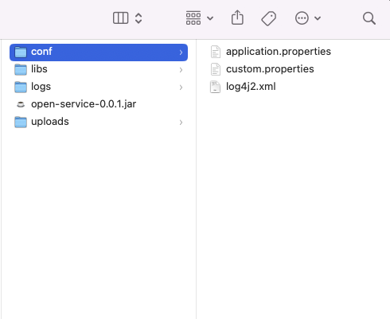

### OPEN-CDP Build And Run ###
1. mvn package

Sau khi build được file trong target có open-service-0.0.1.jar. Để chạy chương trình thì cần tạo cấu trúc folder như sau

2. <strong>Chạy jar File: java -jar open-service-0.0.1.jar</strong>

### Flast Solution ###
